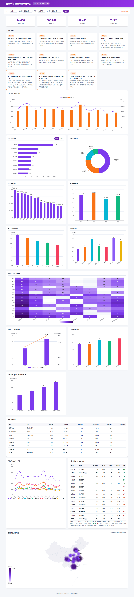
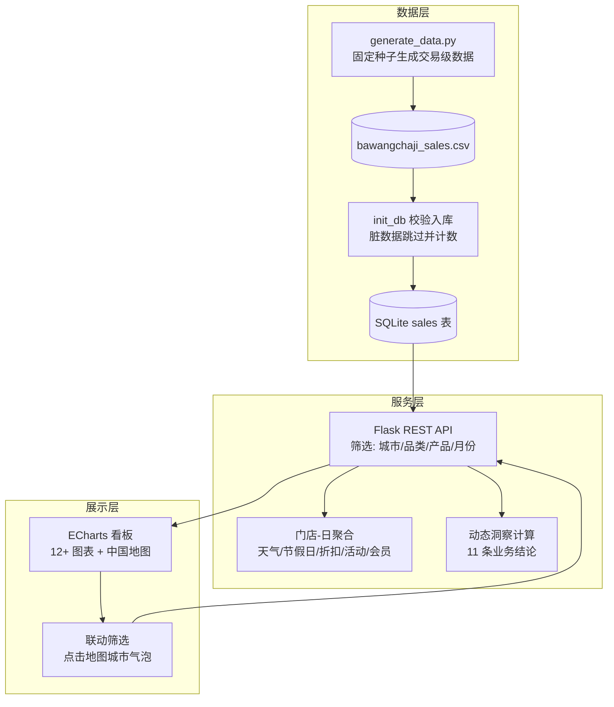
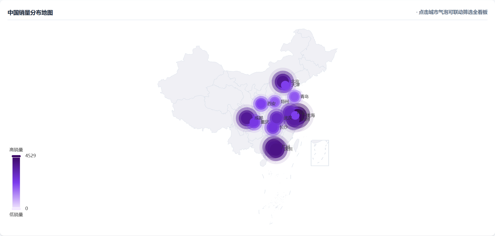
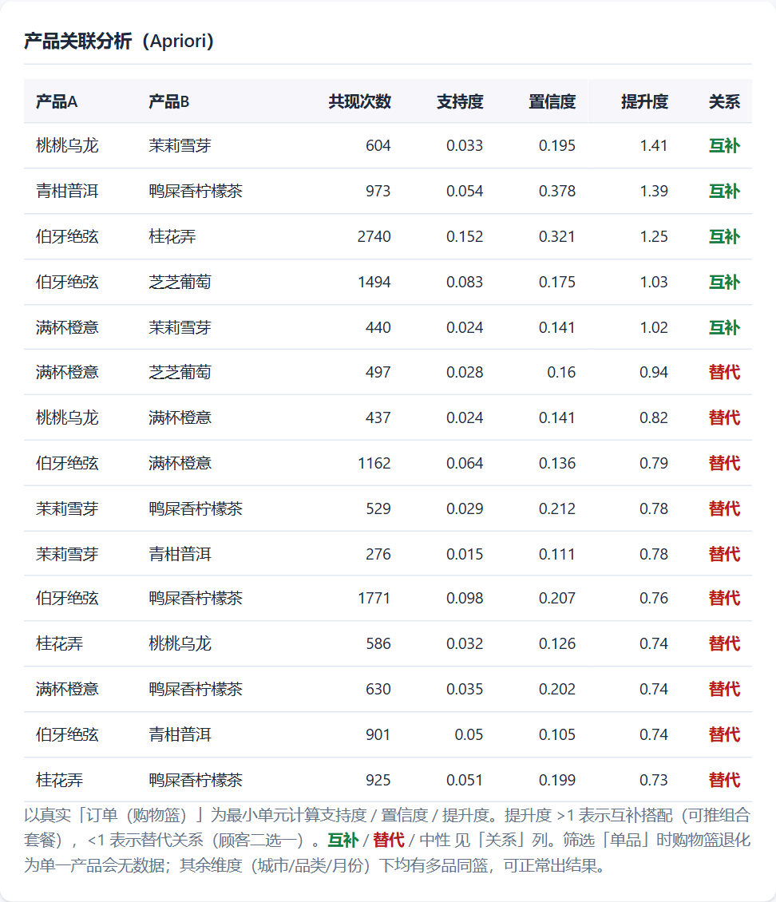
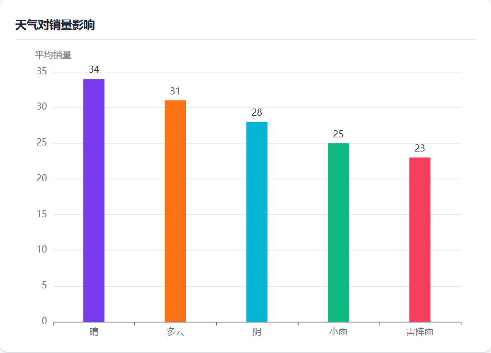
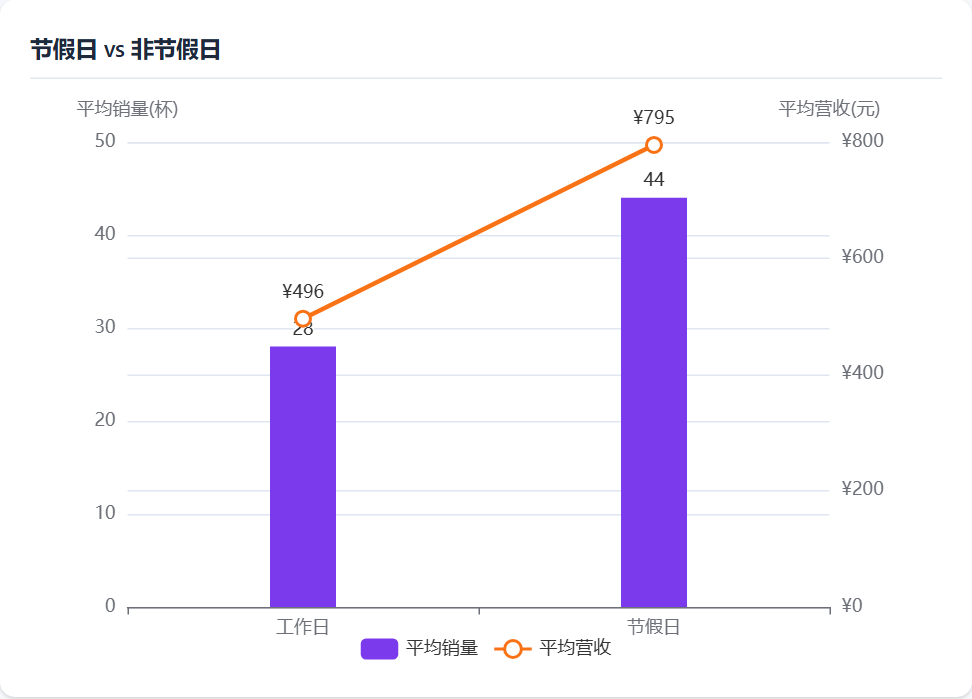
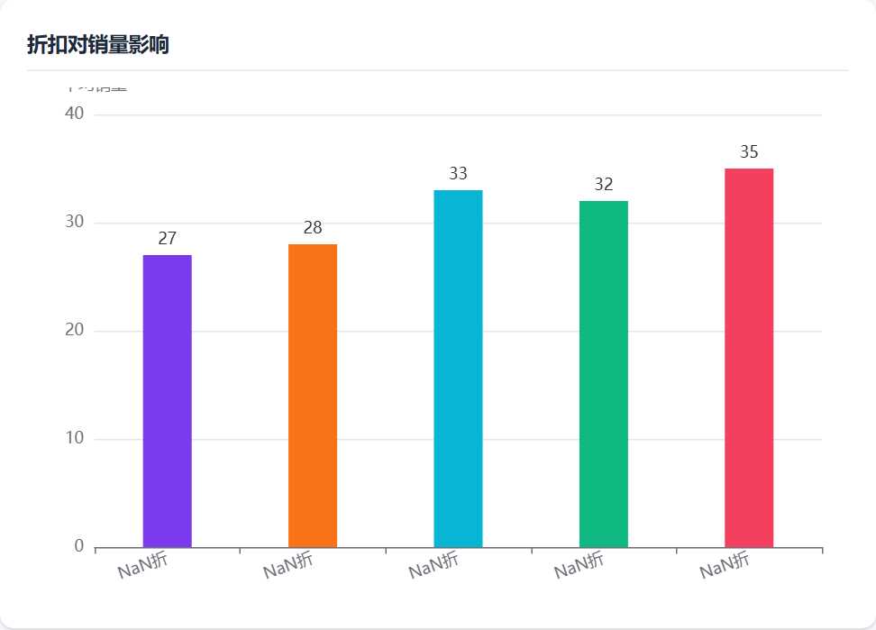
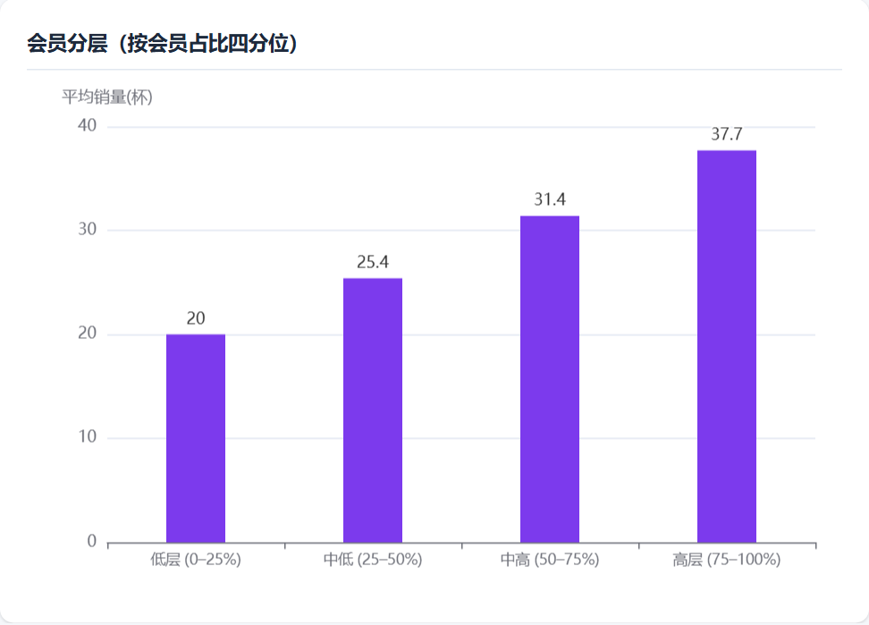
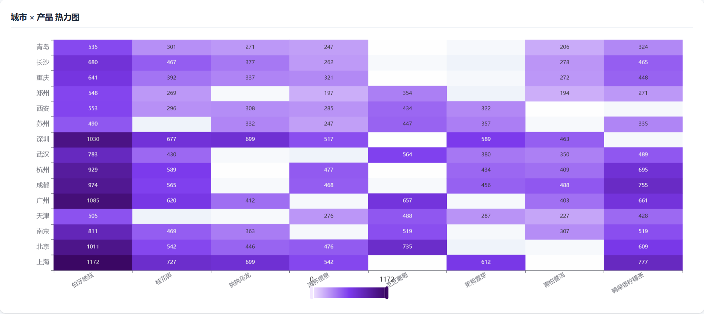
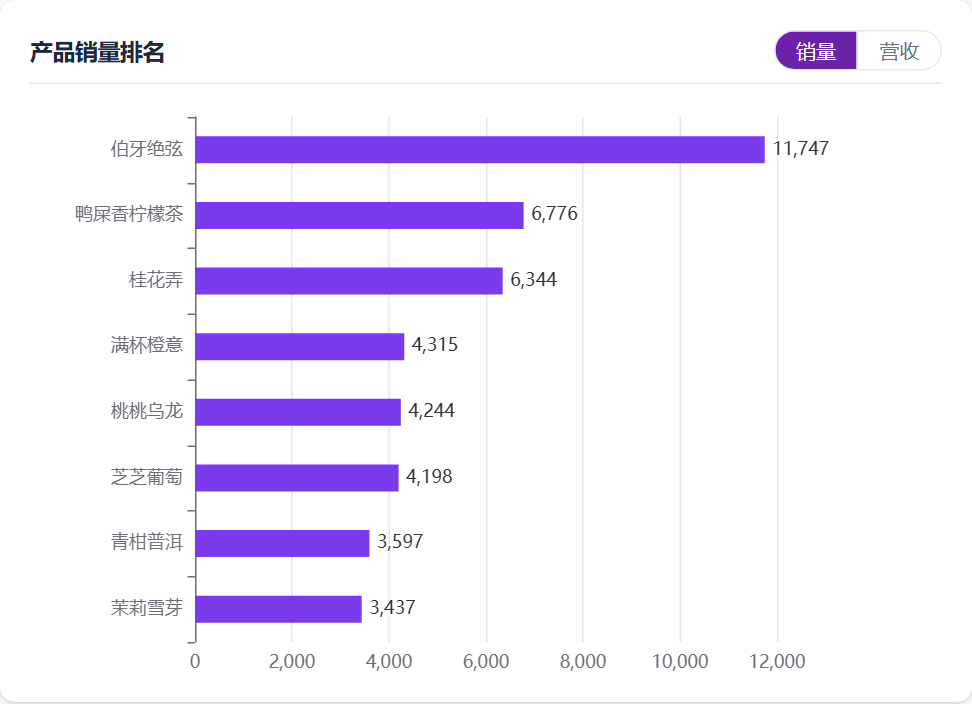

# 霸王茶姬销量数据分析可视化平台

一个面向茶饮零售场景的**销量数据分析与可视化平台**，覆盖 15 座城市、8 款在售产品的 2025 全年销售数据，从天气、季节、节假日、营销活动、会员、折扣等多维度揭示业务规律，并自动生成可解释的分析结论。

> 数据均为教学/演示用途的**模拟数据**（由 `generate_data.py` 固定随机种子生成、可复现），仅用于数据分析方法与实践，**不代表品牌真实经营情况**。

---

## 项目看板预览



> 上为完整看板截图；下方「可视化效果展示」给出关键图表特写。

## 功能特性

- **KPI 总览**：总销量、总营收、记录条数、平均会员占比
- **可视化矩阵**：月度趋势（双轴）、产品排名（**销量/营收 一键切换**）、单品经营明细表、产品月度趋势（多线）、品类占比、城市排名、季节对比、天气影响、营销活动效果、城市×产品热力图、节假日对比、折扣分析、**产品关联分析（Apriori）表**、**中国销量分布地图（可交互）**
- **交互筛选**：支持按「城市 / 品类 / 产品 / 月份（时间维度）」联动筛选，所有图表与结论实时刷新；**地图点击城市气泡可一键联动筛选全看板**
- **分析结论自动生成**：后端基于当前数据动态计算 11 条业务洞察（非硬编码），覆盖区域表现、产品结构、季节规律、价格策略、天气影响、节假日效应、会员运营、增长机会、价格弹性、会员分层与产品关联
- **工程化**：CSV 入库带数据校验（脏数据跳过并计数）、查询结果缓存、环境变量配置、统一 JSON 错误返回

## 技术栈

| 技术 | 作用 |
| --- | --- |
| Python 3 | 运行环境 |
| Flask 3 | 后端框架，提供 REST API 并托管前端静态资源 |
| SQLite | 轻量嵌入式数据库，随应用启动自动从 CSV 初始化 |
| HTML5 / CSS3 | 前端页面结构与样式 |
| ECharts 5 | 图表渲染（CDN 引入） |
| Fetch API | 浏览器原生请求，调用后端接口 |

## 核心流程

平台遵循「数据生成 → 入库 → API 服务 → 前端渲染 → 交互联动」的清晰链路：



- **数据层**：`generate_data.py` 以固定随机种子生成约 3.3 万行交易级数据（含真实订单篮 `订单号`），保证结果可复现；`init_db` 入库时做字段校验，脏数据跳过并计数。
- **服务层**：Flask 提供 REST API，所有查询按「门店-日」聚合（避免交易明细行均值被摊平），并基于当前数据**动态计算 11 条业务洞察**（非硬编码），带查询缓存与统一错误返回。
- **展示层**：前端以 ECharts 渲染 12+ 张图表 + 可交互中国地图；筛选栏（城市/品类/产品/月份）与地图点击均可联动刷新全看板。

## 目录结构

```
project/
├── backend/
│   ├── app.py                # Flask 后端：API + 数据初始化 + 分析结论计算
│   └── generate_data.py      # 交易级模拟数据生成器（固定种子，可复现）
├── data/
│   └── bawangchaji_sales.csv # 原始销售数据（可由生成器复现）
├── frontend/
│   ├── index.html            # 主页面（含筛选栏与分析结论区）
│   ├── css/style.css         # 样式
│   └── js/charts.js          # ECharts 图表逻辑 + 筛选联动
├── docs/images/              # README 用看板截图
└── requirements.txt          # Python 依赖（flask）
```

## 运行方式

```bash
# 1. 创建并激活虚拟环境（可选但推荐）
python -m venv .venv
source .venv/Scripts/activate      # Windows: .venv\Scripts\activate

# 2. 安装依赖
pip install -r requirements.txt

# 3. 启动服务
python backend/app.py

# 4. 浏览器打开
#    http://localhost:8080
```

> 首次启动会自动读取 `data/bawangchaji_sales.csv` 并写入 SQLite；如需重新导入，删除 `backend/bawangchaji.db` 后重启即可。
> **若 `data/bawangchaji_sales.csv` 缺失，后端会自动调用 `backend/generate_data.py`（固定随机种子，结果可复现）重新生成**，无需手动准备数据。
> 可用环境变量覆盖：`PORT`（默认 8080）、`FLASK_DEBUG=1`（开启调试模式）。

## 数据说明

原始数据字段：

| 字段 | 说明 |
| --- | --- |
| date | 日期 |
| city / store_id | 城市 / 门店编号 |
| product / category | 产品名称 / 类别 |
| unit_price / quantity / discount / revenue | 单价 / 销量 / 折扣 / 实付金额 |
| member_pct | 会员占比(%) |
| weather / season | 天气 / 季节 |
| is_holiday / campaign | 是否节假日 / 营销活动 |

## 可视化效果展示

### 中国销量分布地图（可交互，点击城市联动全看板）


### 产品关联分析（Apriori，互补/替代颜色标注）


### 多维对比分析
| 天气对销量影响 | 节假日 vs 非节假日 |
| --- | --- |
|  |  |

| 折扣对销量影响 | 会员分层（按会员占比四分位） |
| --- | --- |
|  |  |

### 城市 × 产品热力图 与 产品销量排名
| 城市 × 产品 热力图 | 产品销量排名（销量/营收切换） |
| --- | --- |
|  |  |

## 核心分析结论（2025 全年，基于当前数据动态计算）

以下结论由平台基于数据**动态计算**，可直接作为面试中的业务理解素材：

1. **区域表现**：营收冠军为上海，约为末位青岛的 2.4 倍，区域差异显著，下沉市场提升空间大。
2. **产品结构**：王牌单品「伯牙绝弦」贡献约 22.9% 营收，是基本盘核心。
3. **季节规律**：夏季为销量旺季、秋季最低——热饮与冷饮结构使夏季反超。
4. **价格策略**：折扣对单店日均销量正向拉动（整体 +12.5%），折扣力度每加深 10% 单店日均约 +17.2%；说明在促销节点合理让利可有效放大销量。
5. **天气影响**：晴天单店日均最高（34 杯），雷阵雨天最低（23 杯），可结合天气预报做动态排班与库存预警。
6. **节假日效应**：节假日单店日均较工作日 +59.7%，大促节点（五一 / 春节 / 清明）显著放量，活动是核心增量来源。
7. **会员运营**：会员占比与销量正相关（r=0.51），会员占比高层门店日均 38 杯、低层仅 20 杯，提升会员拉新与复购对单店产出有显著杠杆。
8. **增长机会**：同一王牌单品在不同城市渗透差异大（如伯牙绝弦在苏州偏弱），可针对性本地化推广。

## 与简历能力映射

本项目用于佐证简历中宣称的数据分析能力，重点落到以下可验证的技能点：

| 简历中的能力 | 本项目中的落地 |
| --- | --- |
| **Python / 数据可视化** | Flask + ECharts 全栈实现，前端 12+ 张图表/数据表 + 分析结论面板 + 可交互中国地图 |
| **SQL（窗口函数 / 多表聚合）** | SQLite 聚合查询；月度趋势使用 `LAG()` 窗口函数计算环比（MoM） |
| **联动筛选 / 时间维度切片** | 城市 / 品类 / 产品 / 月份四维联动筛选，所有图表与结论实时刷新；地图点击城市联动全看板 |
| **从 0 到 1 搭建经营指标体系** | 后端动态计算 KPI + 11 条业务洞察，覆盖区域 / 产品 / 季节 / 价格 / 天气 / 节假日 / 会员 / 增长 / 价格弹性 / 会员分层 / 产品关联 |
| **Python 统计分析 / 建模** | 折扣价格弹性一元线性回归、会员占比四分位分层（呼应 RFM / pd.qcut 思路）、产品关联分析（Apriori 思路） |
| **业务洞察闭环** | 每条洞察均给出"数据 → 结论 → 行动建议"，可直接作为面试讲解素材 |

> **关于产品关联分析（Apriori）的数据说明**：数据为**交易级模拟数据**（约 3.3 万行），**15 个城市 = 15 个门店，每个门店常备 6/8 款产品**，并引入真实「订单（购物篮）」维度（`订单号` 字段，单笔订单含 1~4 款产品）。平台以订单为最小单元真实计算支持度 / 置信度 / 提升度：提升度 >1 表示互补搭配（如 青柑普洱×鸭屎香柠檬茶 1.45、桃桃乌龙×茉莉雪芽 1.39、伯牙绝弦×桂花弄 1.23），<1 表示替代关系（如 桂花弄×茉莉雪芽 0.38）；结果表以颜色标注「关系（互补/替代/中性）」列。数据由 `backend/generate_data.py` 固定随机种子生成，可复现；**按「单品」筛选时购物篮退化为单一产品会无数据（前端会提示原因）**，其余维度均正常出结果。

> Tableau / PowerBI 为简历中并列的可视化工具，本项目以 Web 看板（ECharts）实现等效能力，二者在简历中可互为补充，不建议混为一谈。

## 后续可扩展

- 接入真实订单流，将 CSV 初始化替换为定时 ETL
- 增加时间范围滑块、城市多选、品类下钻等更细粒度筛选
- 引入更进阶的分析模型（如基于用户粒度的 RFM、需求预测、价格弹性交叉验证）
- 将 ECharts 依赖本地化以摆脱 CDN 依赖，提升离线可用性
